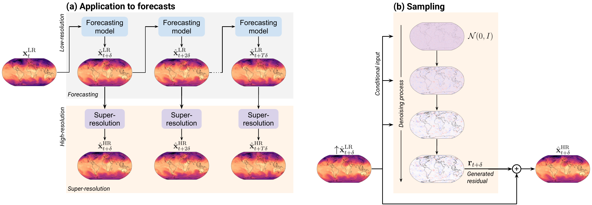

# Super-Resolving Coarse-Resolution Weather Forecasts with Flow Matching

ArchesWeatherSR extends [ArchesWeather & ArchesWeatherGen](https://github.com/INRIA/geoarches) with a super-resolution module: it takes a coarse-resolution (1.5°) weather forecast produced by ArchesWeatherGen and generates an ensemble of plausible high-resolution (0.25°) fields using a flow matching diffusion model. The model learns to predict the residual between a bicubic upsampling of the low-resolution forecast and the ERA5 analysis at 0.25°.



For more information, see the [geoarches](https://geoarches.readthedocs.io/en/latest/) repository and documentation.

## Installation

We recommended using [uv](https://docs.astral.sh/uv/) to manage the environment. After cloning the repo, run:

```bash
git clone <this-repo>
cd archesweathersr
uv sync
```

`uv sync` installs all dependencies and the `archesweathersr` package itself in editable mode, which is required so that imports resolve correctly when running the training and inference scripts.

## Training

Configuration is managed as in [geoarches](https://geoarches.readthedocs.io/en/latest/user_guide/#hydra), using [Hydra](https://hydra.cc). The entry point is `train.py`.

### Basic run

```bash
python train.py \
  module=archesweathersr \
  dataloader=era5downscaling-hdf5 \
  ++name=my_run
```

### Data

ERA5 data was obtained from [WeatherBench2](https://weatherbench2.readthedocs.io/en/latest/data-guide.html). We recommended downloading the data in HDF5 format for use with the `dataloaders.era5_hdf5` dataloader. We provide a small download script with `scripts/dl_era.py`.

## Inference

### Simple evaluation

```bash
python train.py mode=test ++name=my_run
```
Metrics will be saved to `evalstore/<name>/`.

### Super-resolving ArchesWeatherGen forecasts

`archesweathersr.inference.infer_forecasts` super-resolves forecasts produced by ArchesWeatherGen. Each run processes one time slice (identified by `--task-id`) across all input files:

```bash
python -m archesweathersr.inference.infer_forecasts --task-id 0
```

To process multiple time slices in parallel (e.g. as a SLURM job array), pass `$SLURM_ARRAY_TASK_ID` as the task ID:

```bash
# run_sr.sbatch
#!/bin/bash
#SBATCH --array=0-599

python -m archesweathersr.inference.infer_forecasts --task-id $SLURM_ARRAY_TASK_ID
```

We provide a script to produce ArchesWeatherGen rollouts in the correct format for super-resolution with `scripts/rollout_archesweathergen.py`. This requires [downloading the pretrained models](https://geoarches.readthedocs.io/en/latest/archesweather/setup/#2-download-pretrained-models).
